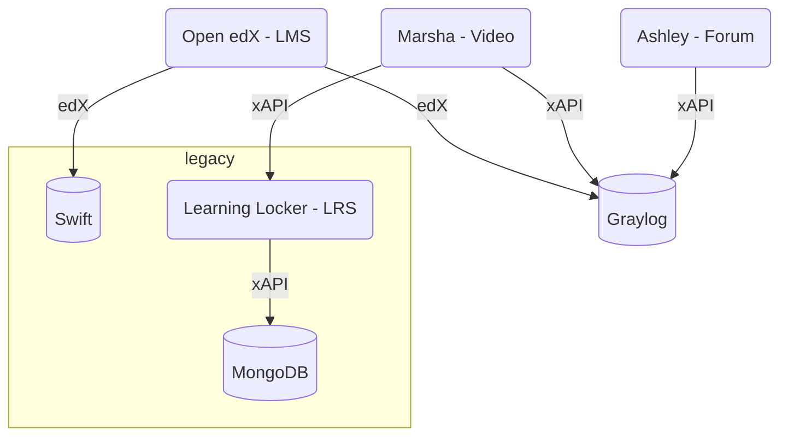
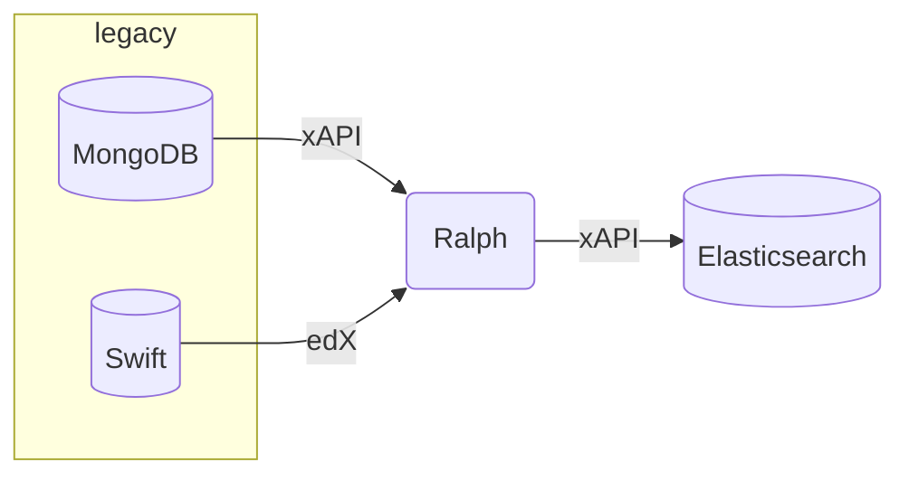
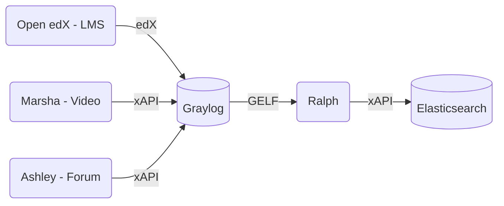

# Context

---
layout: full
class: text-center
---

## How it started

---
layout: image-right
image: /images/a-team.jpg
---

## The plan

    <logos-python /> &nbsp;
    + &nbsp;
    <logos-elasticsearch />

* Setup an [Elasticsearch](https://www.elastic.co/elasticsearch/)-based **data lake** dedicated to learning analytics
* Develop a [Python](https://python.org) tool able to **fetch** & **transform**  data from various backends

---
layout: full
class: text-center
---

## How it's going (1)

---
layout: full
class: text-center
---

## How it's going (2)

